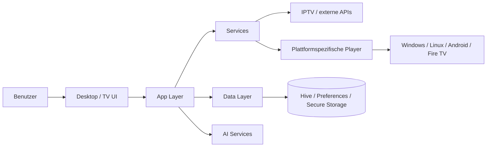

# Aurora IPTV – Project Showcase

> Private source repository · Public architecture & engineering showcase

## Kurzfassung

**Aurora IPTV** ist eine plattformübergreifende Streaming-Anwendung auf Basis von Flutter/Dart.

Das Projekt verbindet Medienwiedergabe, externe Datenquellen, lokale Speicherung, plattformspezifische Player, TV-/Desktop-Oberflächen sowie eigene Build-, Release- und Update-Prozesse.

Der vollständige Produktivcode bleibt privat. Dieses Repository zeigt die technische Struktur, Plattformstrategie und Engineering-Schwerpunkte.

---

## Produktumfang

Aurora IPTV unterstützt im privaten Projekt u. a.:

- Live-TV
- Movies / VOD
- Serien
- EPG
- Timeshift
- Recording
- Catch-up, sofern vom Server unterstützt
- Multi-Screen / Grid-Layouts
- Picture-in-Picture
- Resume-Support
- per-Screen Mute
- plattformspezifische Wiedergabepfade
- Build-, Installer- und Update-Prozesse

---

## Plattformen

Das Projekt enthält eigenständige Plattformbereiche für:

- Windows
- Linux
- Android
- Fire TV

Die Codebasis ist so organisiert, dass gemeinsame Logik und plattformspezifisches Verhalten getrennt behandelt werden können.

---

## Tech Stack

| Bereich | Technologie |
|---|---|
| Framework | Flutter |
| Sprache | Dart |
| State Management | Provider |
| HTTP / API | Dio, http |
| XML | xml |
| Lokaler Storage | Hive, SharedPreferences |
| Secure Storage | flutter_secure_storage |
| Medienwiedergabe | media_kit / MPV |
| Android / Fire TV | Better Player / ExoPlayer |
| Windows | video_player / fvp / FFmpeg |
| Bilder | cached_network_image |
| Audio / Voice | record |
| App Info / Updates | package_info_plus |
| IDs | uuid |

---

## Architektur der Anwendung

Die private Codebasis ist in mehrere Schichten und Verantwortungsbereiche gegliedert:

```text
lib/
├── ai/            KI-spezifische Konfiguration und Services
├── app/           App-Komposition und Plattform-Einstiegspunkte
├── core/          zentrale Services, Storage, Theme, Utilities
├── data/          Datenzugriff und Datenmodelle
├── presentation/  UI-Schichten
├── services/      Anwendungs- und Integrationsservices
├── widgets/       wiederverwendbare UI-Komponenten
└── main.dart
```

Die Präsentationsschicht trennt u. a. Desktop- und TV-spezifische Oberflächen.

---

## Vereinfachtes Systembild



---

## Schnittstellen & Datenquellen

Das Projekt verarbeitet unterschiedliche externe Quellen und Formate.

Dazu gehören u. a.:
- Xtream-basierte Quellen
- M3U
- EPG/XML
- Netzwerkbilder und Metadaten
- Streaming-Endpunkte

Die technische Herausforderung liegt nicht nur in der Darstellung, sondern in der **Vereinheitlichung heterogener Quellen innerhalb eines gemeinsamen Produktmodells**.

---

## Medienarchitektur

Für verschiedene Plattformen werden unterschiedliche Wiedergabe-Backends eingesetzt.

### Desktop
- MPV-basierte Wiedergabe über `media_kit`
- Windows-spezifische FFmpeg-/Hardware-Decode-Optionen

### Android / Fire TV
- ExoPlayer-basierter Wiedergabepfad über Better Player

Damit berücksichtigt das Projekt, dass eine Cross-Platform-App technisch nicht auf jeder Plattform dieselbe Implementierung verwenden kann.

---

## Persistenz & Security

Verwendete Mechanismen:
- Hive für lokale strukturierte Daten
- SharedPreferences für Einstellungen
- Secure Storage für schützenswerte lokale Daten
- klare Trennung zwischen Anwendung und gespeicherten Zugangsdaten

---

## Build- und Release-Automatisierung

Im privaten Repository existieren eigene Skripte für:

- Android-Build
- Fire-TV-APK
- Windows-Build
- Windows-Release
- Windows-Installer
- Linux-Release
- AppImage
- Debian-Paket
- GitHub Releases
- separaten Update-Kanal

Beispiele:

```text
scripts/
├── build_android.ps1
├── build_firetv_apk.ps1
├── build_release_windows.ps1
├── build_windows_installer.ps1
├── build_release_linux.sh
├── create_appimage.sh
├── create_deb.sh
├── publish_github_release.ps1
└── publish_update_channel.ps1
```

---

## Update-Konzept

Das Projekt trennt privaten Quellcode von einem potenziell öffentlichen Update-Kanal.

Dadurch können:
- Quellcode privat bleiben
- Binärdateien separat veröffentlicht werden
- Releases automatisiert verteilt werden

Diese Trennung ist ein Beispiel für die bewusste Gestaltung von **Produkt-, Build- und Betriebsarchitektur**.

---

## Qualitätssicherung

Im Projekt existieren:

- automatisierte Flutter-Tests
- `flutter analyze`
- Fire-TV-/Emulator-QA
- eigene QA-Dokumentation
- technische Spezifikationen
- definierte Arbeitsregeln für Änderungen

Typischer Entwicklungsworkflow:

```text
Aufgabe eingrenzen
   ↓
betroffene Dateien analysieren
   ↓
kleinste sichere Änderung
   ↓
flutter analyze
   ↓
flutter test
   ↓
plattformbezogene Validierung
   ↓
Build / Release
```

---

## Engineering-Regeln im Projekt

Die Entwicklung folgt dokumentierten Prinzipien:

- minimalinvasive Änderungen
- bestehende Architektur respektieren
- Plattformauswirkungen berücksichtigen
- keine stillen Dependency-/Build-Änderungen
- plattformspezifisches Verhalten sauber trennen
- KI-spezifische Logik im dafür vorgesehenen Bereich
- Änderungen validieren und dokumentieren

---

## KI-Komponenten

Die Codebasis besitzt einen eigenen Bereich `lib/ai/`.

Damit wird KI-spezifische Funktionalität bewusst von generischer UI- und Infrastruktur-Logik getrennt.

Der Architekturgrundsatz lautet: KI soll als klar definierte Komponente eingebettet werden, nicht unstrukturiert über die gesamte Anwendung verteilt sein.

---

## Warum dieses Projekt technisch relevant ist

Aurora IPTV zeigt praktische Erfahrung in:

- Cross-Platform-Systemdesign
- Integration heterogener APIs und Datenquellen
- plattformspezifischer Architektur
- lokalen Daten- und Security-Konzepten
- Medien-/Streaming-Technologie
- Build- und Release-Automatisierung
- Update-Architektur
- QA und technische Dokumentation
- Trennung von Produkt-, Plattform- und Infrastrukturbelangen

---

## Bezug zu System Architecture / Data & AI

Das Projekt demonstriert insbesondere:

- Systemzerlegung in klar definierte Module
- Schnittstellen zwischen Daten-, Service- und Präsentationsschichten
- Integration verschiedener externer Systeme
- Umgang mit Plattformabhängigkeiten
- technische Entscheidungen mit Blick auf Betrieb und Wartbarkeit
- Verbindung von Architektur und tatsächlicher Umsetzung
- strukturierte technische Dokumentation und QA

Es ist kein Enterprise-Architekturprojekt. Es zeigt jedoch eine reale, wachsende Anwendung, bei der **Architekturentscheidungen unmittelbare Auswirkungen auf mehrere Plattformen und technische Subsysteme haben**.

---

## Privates Repository

Die vollständige Codebasis enthält zusätzlich:
- Produktdokumentation
- technische Spezifikationen
- QA-Unterlagen
- Team-/Agentenregeln
- Installer
- plattformspezifische Implementierungen
- Release- und Update-Skripte

---

## Status

Aktiver Entwicklungsstand im privaten Repository.

## Hinweis

Dieses Repository dient ausschließlich als **technischer Showcase**.  
Der vollständige Quellcode bleibt privat.
